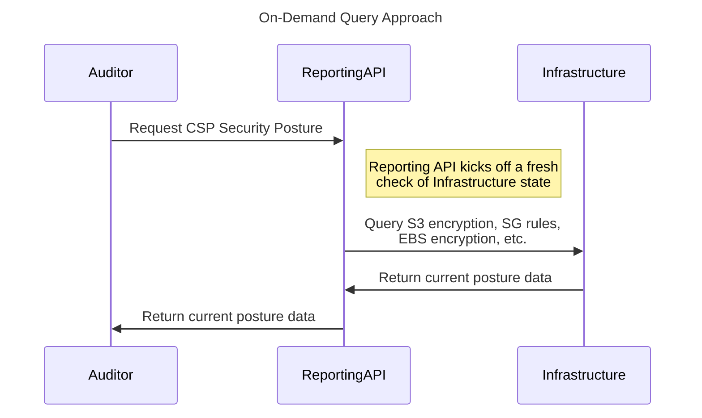
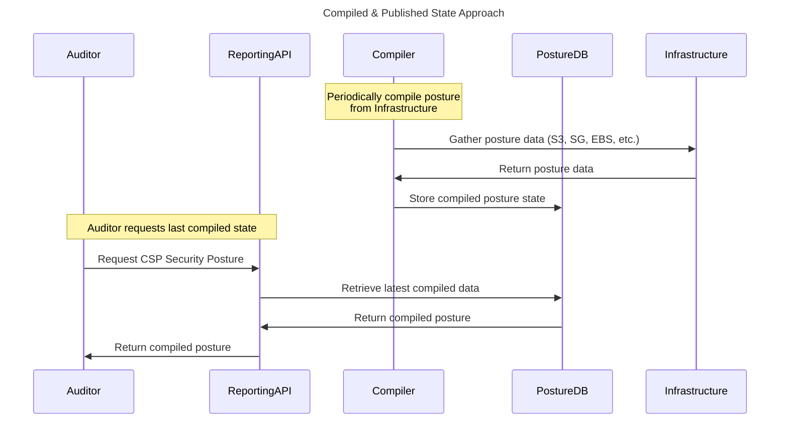

# Metadata

title:Starting small - continuous validation prototyping

author: [github.com/pete-gov](https://github.com/pete-gov)

url: [https://github.com/FedRAMP/automating-assessment-cwg/discussions/10](https://github.com/FedRAMP/automating-assessment-cwg/discussions/10)

created: 2025-04-03T20:52:28Z

id: D_kwDOOMDw3M4AfJNf


# Post

I'm a huge fan of prototyping around simple use cases and I think there are some awesome options to ground this discussion around that approach. Instead of starting with the entire world of everything that could be automated, I wanted to try a tightly scoped initial approach. 

As I have time over the next few days I'm going to work on some prototypes to answer the following question and I think it would be really interesting to see how others would approach it.

-----

# Problem Statement

I have a simple application deployed on cloud native services on a major IaaS offering. My information storage includes:

1. A few hundred files stored in a single object storage location. 
2. Tens of thousands of database records stored in a cloud native database. 

**How can I prove programmatically that all information in the above locations is encrypted?**

# Acceptance Criteria

Result should be a machine readable file that includes:

- Top level determination whether or not all data is encrypted
- Inventory of storage locations and their encryption type


# Comments


## Comment 1

author: [github.com/ethanolivertroy](https://github.com/ethanolivertroy)

url: [https://github.com/FedRAMP/automating-assessment-cwg/discussions/10#discussioncomment-12718968](https://github.com/FedRAMP/automating-assessment-cwg/discussions/10#discussioncomment-12718968)

created: 2025-04-03T21:24:24Z

id: DC_kwDOOMDw3M4AwhN4

If its a major cloud, every major cloud has cloud shell access.
You'd simply have to query the storage bucket and DBs using the native CLIs that are already pre-installed in the cloud shell.
Pick output type `json`

### Replies


#### Reply 1

author: [github.com/ethanolivertroy](https://github.com/ethanolivertroy)

url: [https://github.com/FedRAMP/automating-assessment-cwg/discussions/10#discussioncomment-12718981](https://github.com/FedRAMP/automating-assessment-cwg/discussions/10#discussioncomment-12718981)

created: 2025-04-03T21:26:51Z

id: DC_kwDOOMDw3M4AwhOF

```
{
    "encrypted": true,
    "storage_inventory": [
        {
            "storage_type": "S3",
            "name": "your-bucket-name",
            "encrypted": true,
            "encryption_type": "AES256"
        },
        {
            "storage_type": "RDS",
            "name": "your-db-identifier",
            "encrypted": true,
            "encryption_type": "AWS KMS"
        }
    ]
}
```


#### Reply 2

author: [github.com/ethanolivertroy](https://github.com/ethanolivertroy)

url: [https://github.com/FedRAMP/automating-assessment-cwg/discussions/10#discussioncomment-12719016](https://github.com/FedRAMP/automating-assessment-cwg/discussions/10#discussioncomment-12719016)

created: 2025-04-03T21:31:26Z

id: DC_kwDOOMDw3M4AwhOo

```
#!/bin/bash
# Save as check-encryption.sh

echo "Encryption Status Report" > encryption_report.json
echo "{" >> encryption_report.json
echo "  \"encrypted\": true," >> encryption_report.json
echo "  \"storage_inventory\": [" >> encryption_report.json

# Detect which cloud we're on
if command -v aws &> /dev/null; then
  # AWS checks
  bucket="your-bucket-name"
  echo "Checking AWS S3 bucket: $bucket"
  if aws s3api get-bucket-encryption --bucket $bucket &> /dev/null; then
    encryption=$(aws s3api get-bucket-encryption --bucket $bucket --query "ServerSideEncryptionConfiguration.Rules[0].ApplyServerSideEncryptionByDefault.SSEAlgorithm" --output text)
    echo "  {" >> encryption_report.json
    echo "    \"storage_type\": \"S3\"," >> encryption_report.json
    echo "    \"name\": \"$bucket\"," >> encryption_report.json
    echo "    \"encrypted\": true," >> encryption_report.json
    echo "    \"encryption_type\": \"$encryption\"" >> encryption_report.json
    echo "  }," >> encryption_report.json
  else
    echo "  {" >> encryption_report.json
    echo "    \"storage_type\": \"S3\"," >> encryption_report.json
    echo "    \"name\": \"$bucket\"," >> encryption_report.json
    echo "    \"encrypted\": false," >> encryption_report.json
    echo "    \"encryption_type\": \"None\"" >> encryption_report.json
    echo "  }," >> encryption_report.json
    # Update overall status
    sed -i 's/\"encrypted\": true/\"encrypted\": false/' encryption_report.json
  fi
  
elif command -v az &> /dev/null; then
  # Azure checks
  storage_account="yourstorageaccount"
  echo "Checking Azure Storage Account: $storage_account"
  encryption=$(az storage account show --name $storage_account --query "encryption.services.blob.enabled" --output tsv)
  if [ "$encryption" = "true" ]; then
    echo "  {" >> encryption_report.json
    echo "    \"storage_type\": \"Azure Blob Storage\"," >> encryption_report.json
    echo "    \"name\": \"$storage_account\"," >> encryption_report.json
    echo "    \"encrypted\": true," >> encryption_report.json
    echo "    \"encryption_type\": \"Azure Storage Service Encryption\"" >> encryption_report.json
    echo "  }," >> encryption_report.json
  else
    echo "  {" >> encryption_report.json
    echo "    \"storage_type\": \"Azure Blob Storage\"," >> encryption_report.json
    echo "    \"name\": \"$storage_account\"," >> encryption_report.json
    echo "    \"encrypted\": false," >> encryption_report.json
    echo "    \"encryption_type\": \"None\"" >> encryption_report.json
    echo "  }," >> encryption_report.json
    # Update overall status
    sed -i 's/\"encrypted\": true/\"encrypted\": false/' encryption_report.json
  fi
  
elif command -v gcloud &> /dev/null; then
  # GCP checks
  bucket="your-bucket-name"
  echo "Checking GCP Storage bucket: $bucket"
  encryption=$(gcloud storage buckets describe gs://$bucket --format="value(encryption.defaultKmsKeyName)")
  encryption_type="Google-managed encryption key"
  if [ ! -z "$encryption" ]; then
    encryption_type="Customer-managed encryption key (CMEK)"
  fi
  echo "  {" >> encryption_report.json
  echo "    \"storage_type\": \"GCP Cloud Storage\"," >> encryption_report.json
  echo "    \"name\": \"$bucket\"," >> encryption_report.json
  echo "    \"encrypted\": true," >> encryption_report.json
  echo "    \"encryption_type\": \"$encryption_type\"" >> encryption_report.json
  echo "  }," >> encryption_report.json
fi

# Remove trailing comma and close JSON
sed -i '$ s/,$//' encryption_report.json
echo "  ]" >> encryption_report.json
echo "}" >> encryption_report.json

echo "Report generated: encryption_report.json"
cat encryption_report.json
```


#### Reply 3

author: [github.com/ethanolivertroy](https://github.com/ethanolivertroy)

url: [https://github.com/FedRAMP/automating-assessment-cwg/discussions/10#discussioncomment-12719026](https://github.com/FedRAMP/automating-assessment-cwg/discussions/10#discussioncomment-12719026)

created: 2025-04-03T21:33:34Z

id: DC_kwDOOMDw3M4AwhOy

Prowler is an open source tool that has quite a checks for encryption as well - https://github.com/prowler-cloud/prowler/blob/master/tests/providers/aws/services/s3/s3_bucket_kms_encryption/s3_bucket_kms_encryption_test.py


#### Reply 4

author: [github.com/pete-gov](https://github.com/pete-gov)

url: [https://github.com/FedRAMP/automating-assessment-cwg/discussions/10#discussioncomment-12719148](https://github.com/FedRAMP/automating-assessment-cwg/discussions/10#discussioncomment-12719148)

created: 2025-04-03T21:49:21Z

id: DC_kwDOOMDw3M4AwhQs

Oooh, looks like we took a similar approach (though you actually connected the steps, noice) - and very similar simple output. Very curious to see how other folks would extend this or execute with native compliance tools/etc.


#### Reply 5

author: [github.com/atfurman](https://github.com/atfurman)

url: [https://github.com/FedRAMP/automating-assessment-cwg/discussions/10#discussioncomment-12765657](https://github.com/FedRAMP/automating-assessment-cwg/discussions/10#discussioncomment-12765657)

created: 2025-04-08T14:24:41Z

id: DC_kwDOOMDw3M4AwsnZ

We initially took an approach using the cloud-native tooling and APIs, but the maintenance burden of supporting this toolset across multiple clouds is not trivial, and there wasn't really a clean, maintainable way to assert opinions about how to represent attributes for different resource types across different contexts. An abstraction layer was needed, and we have found [steampipe](https://steampipe.io/ to serve nicely in that capacity. 

✅ Seamless multi-cloud support
✅ Read-only
✅ Its all exposed as SQL
✅ Seamlessly query an arbitrary set of accounts/projects/subscriptions
✅ JSON output
✅ Open source; active community

An example of this is a query for S3 buckets where specific resource attributes are surfaced and normalized for inventory purposes:

```sql
select 
    arn as inv_asset_id,
    'TRUE' as inv_is_virtual,
    case 
        when bucket_policy_is_public is true then 'PUBLIC ACCESS ALLOWED'
        else 'Internal Access Only'
    end as inv_is_public,
    'Object Store' as inv_asset_type_and_function,
    'No - Inherited from AWS' as inv_in_latest_scan,
    case
      when tags['DiagramLabel'] is not null then tags['DiagramLabel']
      else '"S3"'
    end as inv_diagram_label,
    tags['InformationImpactLevel'] as inv_comments,
    tags['Function'] as inv_function,
    tags['SystemAdministrator'] as inv_system_administrator,
    'securityhub' as inv_scanner,
    server_side_encryption_configuration as encryption_config
from aws_s3_bucket;
```

There is an opinionated tagging/labeling convention underlying this approach, but the key thing about it is that we can represent a resource's attributes for FedRAMP inventory _directly on that resource_ and generate an inventory on demand. The inventory is simply an expression of the infrastructure state at time of query.

Regarding the `server_side_encryption_configuration` which I normalized to  `encryption config`; it will be returned as a value that looks something like this: `{"Rules":[{"ApplyServerSideEncryptionByDefault":{"KMSMasterKeyID":null,"SSEAlgorithm":"AES256"},"BucketKeyEnabled":false}]} `. In this case encryption is enabled but a CMK is not in use. Generally CMK usage is mandated, but fortunately we can trivially process that JSON into something a little more human friendly to aid evaluation:

```sql
select 
    -- Extract SSE Algorithm
    server_side_encryption_configuration->'Rules'->0->'ApplyServerSideEncryptionByDefault'->>'SSEAlgorithm' as sse_algorithm,
    -- Extract KMS Master Key ID
    server_side_encryption_configuration->'Rules'->0->'ApplyServerSideEncryptionByDefault'->>'KMSMasterKeyID' as kms_key_id,
    -- Extract BucketKeyEnabled value
    (server_side_encryption_configuration->'Rules'->0->>'BucketKeyEnabled')::boolean as bucket_key_enabled
from aws_s3_bucket;
```

In fact, we can automate that evaluation, and express opinions about how the bucket _should_ be configured as [powerpipe](https://hub.powerpipe.io/) [benchmark checks](https://hub.powerpipe.io/mods/turbot/steampipe-mod-aws-compliance/benchmarks/benchmark.foundational_security_s3). 

This is part of what I was attempting to surface in https://github.com/FedRAMP/rev5-continuous-monitoring-cwg/discussions/15; there has from my perspective been a longstanding gap in FedRAMP's guidance regarding:
1. Which specific resource types are in scope for the inventory
2. What specific attributes need to be expressed for each resource type
3. How those attributes should be normalized

In my view, the inventory is fairly fundamental to all this. If FedRAMP wants to move towards continuously validating the configuration of a class of $THING (whether that that thing be DynamoDB tables, RDS, EC2, Compute VMs, GCS buckets, etc) then:
1. Assert that all instances of $THING within the system be represented on inventory
2. Assert what attributes of $THING need to be expressed in inventory, and how (this can be neatly expressed for the most part as pure SQL if using steampipe)
3. Optionally, assert expected values of attribute(s) for $THING e.g. `the normalized expression of KMSMasterKeyID":` cannot be `null`

It probably goes without saying, but I think that the spreadsheet-bound view of the inventory needs to be discarded for this kind of approach to realize much of its potential. 


#### Reply 6

author: [github.com/trumant](https://github.com/trumant)

url: [https://github.com/FedRAMP/automating-assessment-cwg/discussions/10#discussioncomment-12786257](https://github.com/FedRAMP/automating-assessment-cwg/discussions/10#discussioncomment-12786257)

created: 2025-04-10T04:09:27Z

id: DC_kwDOOMDw3M4AwxpR

I'll echo the vote for Steampipe as a great interface to assess and report on inventory and configuration 


## Comment 2

author: [github.com/pete-gov](https://github.com/pete-gov)

url: [https://github.com/FedRAMP/automating-assessment-cwg/discussions/10#discussioncomment-12719133](https://github.com/FedRAMP/automating-assessment-cwg/discussions/10#discussioncomment-12719133)

created: 2025-04-03T21:47:30Z

id: DC_kwDOOMDw3M4AwhQd

This is an _extremely_ oversimplified example I spun up on AWS:

1. An s3 bucket named `pwx-fedramp-test`

Validation:
```
aws s3api get-bucket-encryption --bucket pwx-fedramp-test | jq '.ServerSideEncryptionConfiguration.Rules[0].BucketKeyEnabled'
true
```

2. An rds instance named `pwx-db-fedramp-test-instance-1`

Validation:
```
aws rds describe-db-instances | jq '.DBInstances[0].StorageEncrypted'
true
```

Understood this is a very simple use case and without any actual automation, I could submit a validation report as follows... maybe we'll use YAML instead of JSON for the giggles?

```
storage_encrypted: true
storage_inventory:
  object:
  - name: pwx-fedramp-test
    type: s3
    encrypted: true
  database:
  - name: pwx-db-fedramp-test-instance-1
    type: rds
    encrypted: true
```

That's excessively simple, but it shows an example report for a simple service that doesn't require anything particularly fancy. I'm obviously skipping the step of automating the querying with a bash script or similar as well as validating the entire inventory, but this was intended to just ponder the vibes of a simple use case.

### Replies


#### Reply 1

author: [github.com/ethanolivertroy](https://github.com/ethanolivertroy)

url: [https://github.com/FedRAMP/automating-assessment-cwg/discussions/10#discussioncomment-12719255](https://github.com/FedRAMP/automating-assessment-cwg/discussions/10#discussioncomment-12719255)

created: 2025-04-03T22:07:23Z

id: DC_kwDOOMDw3M4AwhSX

I think it would be pretty easy to implement for cloud-native offerings in a major cloud. All the tools are already there to show the implementation.

What I've been thinking about is trying to figure out is how do we make sure the validation report is genuine and someone didn't just open up vscode and write up some compliant json/yaml?

I was thinking maybe some sort of hashing for the script to ensure the output is actually authentic?

Obviously 3PAOs could just observe the run with a shoulder surf to validate the results before capturing the output. But how else could that be done?

The CSO could just create an 'auditor' read-only account in their AWS/Azure/GCP/etc environment and provide FedRAMP/3PAO with an API token to run a cronjob let's say monthly? Then send a flamer when encryption spits back `false`


#### Reply 2

author: [github.com/aj-stein-gsa](https://github.com/aj-stein-gsa)

url: [https://github.com/FedRAMP/automating-assessment-cwg/discussions/10#discussioncomment-12721179](https://github.com/FedRAMP/automating-assessment-cwg/discussions/10#discussioncomment-12721179)

created: 2025-04-04T03:43:43Z

id: DC_kwDOOMDw3M4Awhwb

> That's excessively simple, but it shows an example report for a simple service that doesn't require anything particularly fancy. I'm obviously skipping the step of automating the querying with a bash script or similar as well as validating the entire inventory, but this was intended to just ponder the vibes of a simple use case.

I have some follow-up considerations not to overly complicate it, but some practical considerations if I had to use it some more.

1. We cool knowing the foundational storage is encrypted a certain way (e.g. S3), nothing about the individual objects inside of them?
1. Do we need to know the time this report occurred? Or maybe even like some placeholder to say it came before or after the last report?
1. Do we need to know PeteSoft runs on AWS or some other cloud service offering from a different CSP? Maybe it runs on multiple services. If so, we definitely need to know each one then?
1. Do we need to explain that `type: s3` or `type: rds` belong to AWS or a specific "tier" of AWS cloud service offerings? (I think Amazon calls them partitions, [turns out they still do](https://github.com/boto/botocore/blob/71c41781a74c55e9f64c2424d6c11513b9ee704d/botocore/data/partitions.json); RDS on GovCloud is a partition separate from AWS Commerical)
1. What's if PeteSoft's simple service has one security nerd that is part of a engineering team of four or five people, and they heard it is good sense to separate some of their app into multiple AWS accounts for defense in depth, do we need to be able to know how the different stuff in different accounts compose into once nice Petesoft app? I could see two different views for this, curious on what you think.


## Comment 3

author: [github.com/aj-stein-gsa](https://github.com/aj-stein-gsa)

url: [https://github.com/FedRAMP/automating-assessment-cwg/discussions/10#discussioncomment-12720875](https://github.com/FedRAMP/automating-assessment-cwg/discussions/10#discussioncomment-12720875)

created: 2025-04-04T03:24:10Z

id: DC_kwDOOMDw3M4Awhrr

> Result should be a machine readable file that includes:
> 
> Top level determination whether or not all data is encrypted

Do we need a true/false answer if we answer the following below and N/N 100% have answers that mean encrypted?

> Inventory of storage locations and their encryption type

Does "encryption" just mean "the lower level" storage or can also mean DB "database-level" encryption? Row-level encryption? Or "AJ, that's all far too complicated, I really just want to see a report of whatever the managed service says is encrypted,"  @pete-gov?

### Replies


#### Reply 1

author: [github.com/kamamanh](https://github.com/kamamanh)

url: [https://github.com/FedRAMP/automating-assessment-cwg/discussions/10#discussioncomment-12780588](https://github.com/FedRAMP/automating-assessment-cwg/discussions/10#discussioncomment-12780588)

created: 2025-04-09T15:58:29Z

id: DC_kwDOOMDw3M4AwwQs

> Does "encryption" just mean "the lower level" storage or can also mean DB "database-level" encryption? Row-level encryption? Or "AJ, that's all far too complicated, I really just want to see a report of whatever the managed service says is encrypted," @pete-gov?

I think that's a really good question and the type of thing my devs would ask if given this as a task. 


## Comment 4

author: [github.com/dljenkins](https://github.com/dljenkins)

url: [https://github.com/FedRAMP/automating-assessment-cwg/discussions/10#discussioncomment-12725233](https://github.com/FedRAMP/automating-assessment-cwg/discussions/10#discussioncomment-12725233)

created: 2025-04-04T11:40:03Z

id: DC_kwDOOMDw3M4Awivx

Each CSP offering the object store or database store should provide an API to query the status of the encryption settings as part of the service itself. The CSP providing the SaaS on top of that service would simply point to the service used and allow it to be checked via the hyperscalers API.

I'm envisioning a section in OSCAL for validation. The section would reference the control(s), identify the API call, secrets to use, and expected response. The 3PAO would only need to validate this one time that it was implemented correctly and thereafter we just enable clients to invoke on-demand or have it invoked as part of a compliance dashboard the client has access to.

### Replies


#### Reply 1

author: [github.com/kamamanh](https://github.com/kamamanh)

url: [https://github.com/FedRAMP/automating-assessment-cwg/discussions/10#discussioncomment-12768248](https://github.com/FedRAMP/automating-assessment-cwg/discussions/10#discussioncomment-12768248)

created: 2025-04-08T17:48:27Z

id: DC_kwDOOMDw3M4AwtP4

Is the expectation here that it is an API of the IaaS solution (ie, a govcloud query string with AWS IAM user/credentials?), or that the CSP would be building an application/API to provide that? 


#### Reply 2

author: [github.com/dljenkins](https://github.com/dljenkins)

url: [https://github.com/FedRAMP/automating-assessment-cwg/discussions/10#discussioncomment-12769588](https://github.com/FedRAMP/automating-assessment-cwg/discussions/10#discussioncomment-12769588)

created: 2025-04-08T19:55:21Z

id: DC_kwDOOMDw3M4Awtk0

CSP would provide the APIs in OSCAL format. Industry can make tools to consume this, invoke the APIs, and build dashboards from the results. Below is a quick sample of what I'm thinking where the configuration of each tests also has assertions to confirm the response.

```
{ "validation" :
	"secrets": {
		"db2-api-key" : {
			"type":"aws-secrets-manager",
			"secretName": "arn:aws:secretsmanager:us-east-1:db2-api-key",
			"region":"us-gov-east-1",
			"value":""
		}, 
		…
	},
	"tests": [
		{
			"name": "test name",
			"type": "cloud-native-configured | auto-validation | agentic-enforcement |infra-as-code",
			"controls": ["ca-2_a", "ca-3_c", "si-2_a", "si-2_b"],
			"protocol": "https",
			"get" : "xxx.yyy.zzz/test1,
			"headers": {
				"apiKey": {path: "#/validation/system/secrets/db2-api-key/value"},
				"Content-Type": {value: "xxx"},
				…
			},
			"params": {
				"paramName": "param-value",
				…
			},
			"response": {
				"_comments": "must support int, long, string, date/time plus a date function, basic math functions, and date add/subtract days",
				"assertTrue": {path: "#/response/status"},
				"assertEqual": {path: "", value: ""},
				"assertNotEqual": {path: "", value: ""},
				"assertGreaterThan": {path: "Date(#/response/body/modified-at", value: "Date('now)+365"}
			}
		}
	]
}
```


#### Reply 3

author: [github.com/aj-stein-gsa](https://github.com/aj-stein-gsa)

url: [https://github.com/FedRAMP/automating-assessment-cwg/discussions/10#discussioncomment-12769612](https://github.com/FedRAMP/automating-assessment-cwg/discussions/10#discussioncomment-12769612)

created: 2025-04-08T19:58:14Z

id: DC_kwDOOMDw3M4AwtlM

My personal impression very generally from skimming: I like the JSON structure, but it is not OSCAL (or approximating) and I think that is a good thing for this exploration and longer-term evaluation. We can keep it simple. 😄 


#### Reply 4

author: [github.com/dljenkins](https://github.com/dljenkins)

url: [https://github.com/FedRAMP/automating-assessment-cwg/discussions/10#discussioncomment-12769708](https://github.com/FedRAMP/automating-assessment-cwg/discussions/10#discussioncomment-12769708)

created: 2025-04-08T20:10:41Z

id: DC_kwDOOMDw3M4Awtms

Agreed, it's not OSCAL it's JSON that could be adopted by OSCAL :)


#### Reply 5

author: [github.com/vennemp](https://github.com/vennemp)

url: [https://github.com/FedRAMP/automating-assessment-cwg/discussions/10#discussioncomment-12778373](https://github.com/FedRAMP/automating-assessment-cwg/discussions/10#discussioncomment-12778373)

created: 2025-04-09T13:13:34Z

id: DC_kwDOOMDw3M4AwvuF

@dljenkins This is great.  I had a similar idea but you fleshed out it probably better than I could have. Qq: Are you suggesting that the API acts as an abstraction layer for querying the CSP's underlying infrastructure state directly? Or the state is pre-compiled and reported to the API?

### 1

### 2



#### Reply 6

author: [github.com/kamamanh](https://github.com/kamamanh)

url: [https://github.com/FedRAMP/automating-assessment-cwg/discussions/10#discussioncomment-12780325](https://github.com/FedRAMP/automating-assessment-cwg/discussions/10#discussioncomment-12780325)

created: 2025-04-09T15:37:41Z

id: DC_kwDOOMDw3M4AwwMl

When we're building out these ideas, let's not forget to factor in risk and cost.  The more complex you make the system, the more things you have to scan, STIG, patch, pay usage for, etc.   But also, just having a public API available to query the full security posture of a CSO's infrastructure makes my GRC heart seize. 


#### Reply 7

author: [github.com/vennemp](https://github.com/vennemp)

url: [https://github.com/FedRAMP/automating-assessment-cwg/discussions/10#discussioncomment-12780778](https://github.com/FedRAMP/automating-assessment-cwg/discussions/10#discussioncomment-12780778)

created: 2025-04-09T16:12:17Z

id: DC_kwDOOMDw3M4AwwTq

Fair point about the API - while not explicitly mentioned, I was assuming the public API would have some level of authentication on it - ideally OIDC/OAUTH2 tied to agency's IdP.  


#### Reply 8

author: [github.com/dljenkins](https://github.com/dljenkins)

url: [https://github.com/FedRAMP/automating-assessment-cwg/discussions/10#discussioncomment-12780989](https://github.com/FedRAMP/automating-assessment-cwg/discussions/10#discussioncomment-12780989)

created: 2025-04-09T16:27:57Z

id: DC_kwDOOMDw3M4AwwW9

I think that its a mix of 1 & 2. We should allow for realtime requests for posture data, but the CSP should be able to cache results to prevent being overtaxed. The cache time would likely vary based on the impact the requests may have on the system, so would be realtime all the time and others may have a cache cycle of days or weeks.


#### Reply 9

author: [github.com/kamamanh](https://github.com/kamamanh)

url: [https://github.com/FedRAMP/automating-assessment-cwg/discussions/10#discussioncomment-12781838](https://github.com/FedRAMP/automating-assessment-cwg/discussions/10#discussioncomment-12781838)

created: 2025-04-09T17:48:32Z

id: DC_kwDOOMDw3M4AwwkO

> I was assuming the public API would have some level of authentication on it - ideally OIDC/OAUTH2 tied to agency's IdP.

@vennemp - I did assume there will be auth of some kind, but an agency's IdP brings in other complications:  the 3PAO now needs agency level access, rather than CSP access, and also the API either needs to exist in each agency/customer environment, or needs to be able to tie to many different IdPs simultaneously.  If it's in the agency/customer environment, is the scope of access just to the agency components within the CSP, or are we having to look at giving the agency environment access to things that would normally be outside their tenant and it's permission set or visibility?  

If we scope the API to just what is in the agency/customer environment, it's easier from a technical standpoint to hand off all auth to the agency's IdP. We make access a customer responsibility, and the CSP is happy to not have to manage that.  Scoping to just the agency's view would be great from a least privilege perspective - Agency A doesn't need to know the security posture of Agency B's environment. But the 3PAO is then logging into all of those APIs to collate data for audit. Or there needs to be a separate API for CSP level view.  And there's the question about whether the Agency wants/needs to see the security posture of things that are outside the normal permission set of it's environment/application to get an understanding of the posture of the CSO as a whole.  

For example, if each customer environment is made up of a container pod (or VM pool), a DB, some storage that is typically the scope of what the processes running inside that pod can see.  Customer A's pod can't see Customer B's pod.  But it is also likely that neither of those pods can see the database tied to the SIEM or vuln management system.  An auditor would want to know that the DBs in all those places are properly encrypted.  So does the auditor access Customer A API, Customer B API, and also a CSP internal API?  (And get logins from all those agencies - this will not scale well).  Does the Agency Customer care only about encryption of their own DB and not of the SIEM? Or do they want to see both, because the SIEM affects the overall security posture of the CSO that their Customer pod lives in? 

I imagine that what is easier for one CSP will be hard for another based on the number of agencies and differences in the way their CSO is structured and segmented.  


#### Reply 10

author: [github.com/vennemp](https://github.com/vennemp)

url: [https://github.com/FedRAMP/automating-assessment-cwg/discussions/10#discussioncomment-12791247](https://github.com/FedRAMP/automating-assessment-cwg/discussions/10#discussioncomment-12791247)

created: 2025-04-10T12:36:37Z

id: DC_kwDOOMDw3M4Awy3P

@kamamanh you raised some good points.

1. Perhaps a better option would be to integrate with login.gov and authorizing pre-defined identities(or maybe tiered - e.g., all .gov identities have some visibility into security posture).  E.g., pete@gsa.gov and brian@gsa.gov can use login.gov but only pete would get authorized.  Login.gov does support non .gov identities, 3PAOs could just register there.  Unsure on claims provided by login.gov but would hope you could enforce PIV/CAC for .gov identities and phishing-resistant MFA for commercial identities.  (I was not required to register a PIV/FIDO2 authenticator on my account creation - but would hope CSP could enforce that in claims issued).
2. Your point on multi-tenancy is well-taken.  Would prefer to be customer-specific (but that adds complexity).  Using the claims from login.gov identities you could include only customer-relevant data (i.e., filter on email domain).  Would require consistent tagging/metadata on infrastructure - shared infrastructure components would be included automatically.  
3. Your mention of shared services made think.   Security posture would be included in all reports.  But also some reporting metrics on how tenants are at least logically separated - e.g.., unique Splunk Indexes, unique Agent Groups.
4. How would usage of SaaS be reflected? Like what if I'm using MongoDB for DBaaS, Splunk Cloud for a SIEM, or Okta Gov for privileged user authn? You wouldn't have visibility into lower-level configurations (unless you had a login.gov account and that SaaS provider gave you access through THEIR API for reporting).  But that doesn't preclude you from secure configuration at SaaS level too.  Unfortunately there is pandemic of shortage on security benchmarking for SaaS apps - SCUBA only gives explicit guidance on O365, i'm not aware of a single CIS benchmark (other than Major CSPs like Google, AWS, Azure, OCI), and aware of only a fews STIGs (Entra ID, MS Defender, TrendMicro TippingPoint, and another widely used SaaS that isn't publicly available yet)

